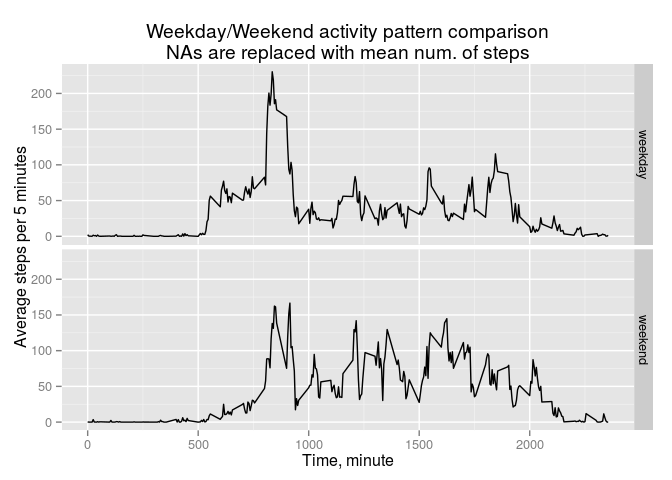

# Reproducible Research: Peer Assessment 1

## Loading and preprocessing the data

```r
library(data.table)
DT <- fread('activity.csv', colClasses = c('integer', 'character', 'integer'))
DT[, date := as.Date(date)]
```

```
##        steps       date interval
##     1:    NA 2012-10-01        0
##     2:    NA 2012-10-01        5
##     3:    NA 2012-10-01       10
##     4:    NA 2012-10-01       15
##     5:    NA 2012-10-01       20
##    ---                          
## 17564:    NA 2012-11-30     2335
## 17565:    NA 2012-11-30     2340
## 17566:    NA 2012-11-30     2345
## 17567:    NA 2012-11-30     2350
## 17568:    NA 2012-11-30     2355
```

## What is mean total number of steps taken per day?


```r
steps.each.day <- DT[!is.na(steps), .(NSteps=sum(steps)), by = date]
library(ggplot2)
# plot histogram
ggplot(steps.each.day, aes(NSteps)) + 
  geom_histogram(binwidth=1000, colour = 'white', fill = 'lightblue')+
  labs(x='Total number of steps per day', 
       title = 'Histogram of total steps per day (NAs are excluded)')
```

 


```r
library(pander)
pandoc.table(summary(steps.each.day$NSteps),
             style = 'rmarkdown', 
             caption = 'Summary of total steps each day')
```


|  Min.  |  1st Qu.  |  Median  |  Mean  |  3rd Qu.  |  Max.  |
|:------:|:---------:|:--------:|:------:|:---------:|:------:|
|   41   |   8841    |  10760   | 10770  |   13290   | 21190  |

Table: Summary of total steps each day


## What is the average daily activity pattern?


```r
avg.steps.5m <- DT[, .(avg=mean(steps, na.rm = T)), by = interval]
qplot(data = avg.steps.5m, interval, avg, geom='line')+
  geom_line(colour = 'darkgreen')+ 
  labs(x = 'Time, minute', y = 'Mean num. steps',
       title = 'Average step counts per 5-minute (NAs excluded)')
```

 


```r
# Order by average steps (descending)
avg.steps.5m[order(-avg), ]
```

```
##      interval      avg
##   1:      835 206.1698
##   2:      840 195.9245
##   3:      850 183.3962
##   4:      845 179.5660
##   5:      830 177.3019
##  ---                  
## 284:      350   0.0000
## 285:      355   0.0000
## 286:      415   0.0000
## 287:      500   0.0000
## 288:     2310   0.0000
```

## Imputing missing values

```r
num.NA <- sum(is.na(DT$steps))
num.NA
```

```
## [1] 2304
```
Unfortunately, there are 2304 records
with NA in the dataset. Here we assign the average value 
to missing fields.  Missing step counts (i.e., NAs) are
repalced by the average count corresponding to
the interval.  


```r
setkey(avg.steps.5m, interval)
missing.set <- DT[is.na(steps), ]
setkey(missing.set, interval)
# Look up mean steps for a interval and fill in missing set
temp <- avg.steps.5m[missing.set, .(avg, interval, date)]
setnames(temp, c('steps', 'interval', 'date'))
x <- DT[!is.na(steps), ]
new.DT <- rbind(x, temp)
```


```r
steps.each.day <- new.DT[, .(NSteps=sum(steps)), by = date]
ggplot(steps.each.day, aes(NSteps)) + 
  geom_histogram(binwidth = 1000,
                 colour = 'white', fill = 'lightblue')+
  labs(x='Total number of steps per day', 
       title='Updated dataset with NA replaced by mean step count')
```

 

For the updated dataset, let's look at some statistics of steps per day.


```r
pandoc.table(summary(steps.each.day$NSteps), style = 'rmarkdown')
```


|  Min.  |  1st Qu.  |  Median  |  Mean  |  3rd Qu.  |  Max.  |
|:------:|:---------:|:--------:|:------:|:---------:|:------:|
|   41   |   9819    |  10770   | 10770  |   12810   | 21190  |

## Are there differences in activity patterns between weekdays and weekends?


```r
new.DT[, ':='(weekday=weekdays(date),
              group='weekday')]
```

```
##           steps       date interval   weekday   group
##     1: 0.000000 2012-10-02        0   Tuesday weekday
##     2: 0.000000 2012-10-02        5   Tuesday weekday
##     3: 0.000000 2012-10-02       10   Tuesday weekday
##     4: 0.000000 2012-10-02       15   Tuesday weekday
##     5: 0.000000 2012-10-02       20   Tuesday weekday
##    ---                                               
## 17564: 1.075472 2012-11-04     2355    Sunday weekday
## 17565: 1.075472 2012-11-09     2355    Friday weekday
## 17566: 1.075472 2012-11-10     2355  Saturday weekday
## 17567: 1.075472 2012-11-14     2355 Wednesday weekday
## 17568: 1.075472 2012-11-30     2355    Friday weekday
```

```r
new.DT[weekday=='Sunday'|weekday=='Saturday', group:='weekend']
```

```
##           steps       date interval   weekday   group
##     1: 0.000000 2012-10-02        0   Tuesday weekday
##     2: 0.000000 2012-10-02        5   Tuesday weekday
##     3: 0.000000 2012-10-02       10   Tuesday weekday
##     4: 0.000000 2012-10-02       15   Tuesday weekday
##     5: 0.000000 2012-10-02       20   Tuesday weekday
##    ---                                               
## 17564: 1.075472 2012-11-04     2355    Sunday weekend
## 17565: 1.075472 2012-11-09     2355    Friday weekday
## 17566: 1.075472 2012-11-10     2355  Saturday weekend
## 17567: 1.075472 2012-11-14     2355 Wednesday weekday
## 17568: 1.075472 2012-11-30     2355    Friday weekday
```

```r
new.DT$group <- factor(new.DT$group, levels = c('weekday','weekend'))
avg.step <- new.DT[group=='weekday', .(avg=mean(steps)), by=interval]
avg.step.2 <- new.DT[group=='weekend', .(avg=mean(steps)), by=interval]
plot.df <- merge(x = avg.step, y = avg.step.2,
                 by = 'interval', all = T)
setnames(plot.df, c('interval', 'weekday', 'weekend'))
library(reshape2)
plot.df.m <- melt(plot.df, id.vars = 'interval',
                  variable.name = 'group', value.name = 'avg')
ggplot(plot.df.m, aes(x = interval, y = avg)) +
  geom_line() + facet_grid(group ~ .) + 
  labs(x = 'Time, minute', y = 'Average steps per 5 minutes',
       title = 'Weekday/Weekend activity pattern comparison\nNAs are replaced with mean num. of steps')
```

 
